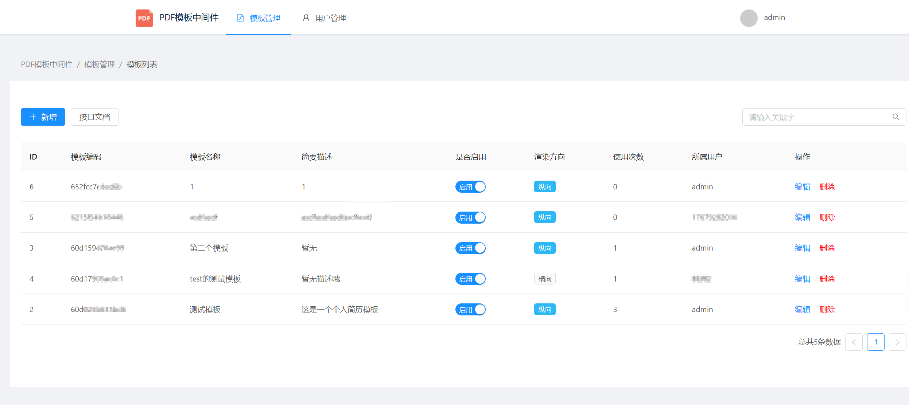
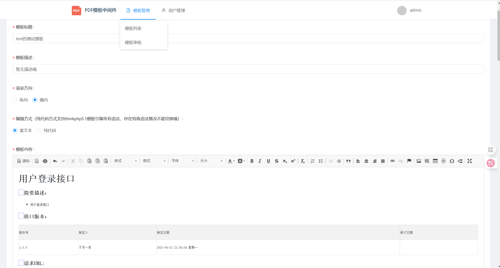

# PDF模板中间件

该工具可以根据后台设置的PDF模板渲染生成PDF文件，提供多用户管理，PDF模板管理、审核、预览等功能，支持通过API调用的方式生成PDF文件

## 主要实现技术：

+ Thinkphp5.1
+ Ant Design Pro
+ nginx
+ mysql
+ docker
+ docker-compose

## 目录结构

初始的目录结构如下：

~~~
hello_pdf_template
├── code
│   ├── api  //thinkphp5.1代码
│   │   └── 
│   │       ├── application
│   │       ├── config
│   │       ├── database
│   │       ├── extend
│   │       ├── public
│   │       ├── route
│   │       ├── runtime #sqlite数据库文件、后端日志缓存
│   │       ├── thinkphp
│   │       └── vendor
│   └── web  //前端Ant Design Pro代码
│       └── 
│           ├── config
│           ├── dist
│           ├── lambda
│           ├── mock
│           ├── public
│           ├── scripts
│           ├── src
│           └── tests
├── config  //nginx、php、supervisor配置文件
│   ├── nginx
│   │   └── vhost
│   ├── php
│
└── runtime //运行时产生的日志等文件
    └── nginx
        └── wwwlogs
~~~

## 安装

> 安装前，机器必须安装docker、和docker-compose环境

拉取代码

~~~
 git clone https://github.com/luler/hello_pdf_template.git
~~~

运行docker-compose

~~~
docker-compose up -d
~~~

然后就可以在浏览器中访问，默认登录账号密码：admin/admin

~~~
http://localhost:12345
~~~

需要修改访问端口的，只需编辑 docker-compose.yml 的 ports 配置

# 注意事项

1. 该项目使用了sqlite数据库，默认的数据库文件会自动生成并保存在 `code/api/runtime/` 目录下
2. 生成的PDF文件不会永久保存，默认定期1天后清理，可调整code/api/.env的参数REMOVE_TEMP_PDF_FILE_DAY控制，0表示不删除

## 在线演示试用

> https://cas.luler.top/?search=62109f1f0ef20

## 系统截图

